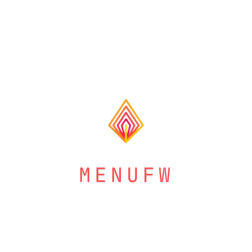

<p align="center">
  
</p>

# UFW-Menu
Uncomplicated Firewall menu is 100% Bash script that automate the process of setting up and configuring the UFW firwall, as well as presenting some advanced features.

# Requirements
Only 2 requirements are needed to run the script:
- UFW: 
```bash
sudo apt install ufw
```
- dialog:
```bash
sudo apt install dialog
```
**edit**: Manually installing dependencies is no longer needed for the scripts does it automatically now
# How To Run
1. Clone this repository to your system. **Note**: It is mainly targeted toward debian based systems.
`git clone https://github.com/TheMadTomato/UFW-Menu` 
2. Go into the directory and change the permission
`cd UFW-Menu && chmod u+x ufw_menu.sh` 
> If you prefer you can run the scrupt without changing permission by running `bash ufw_menu.sh`
3. Run the script
`./ufw_menu.sh`

# Current Bugs 
None Currently waiting for testing 

# Solved Bugs
- Deleting rules sometimes results in errors 
> Bug is sloved, user should just input the rule number in reverse from greater to smaller.

# Current Capabilites
- Basic UFW enable/disable and full status view
- Abilitie to Allow, Deny, and Delete multiple rules at once
- Ability to load a default profile (only changed by editing the code, further updates are coming for this feature)
- Ability to log every action made by the program These log can be read, and backed up from within the program
- Ability to reset ufw by a button click
- Ability to Disable or Enable incmoning ICMP(ping) requests by a click of a buttton
- Only runnable with sudo privleges
- Ability to check for the dependency and install them if they do not exist at launch

  
# To Do 
- Add a feature to enable/disable logging(built in UFW feature)
- The current Rules managment is a bit limited. We can include the some advanced features such as edit rules to manage the Direction, Policy, Interfaces, Log?(built in one), Protocol, IP, and Port.
- Sepereate the Basic rule Managment menu from the advanced one. 
- Prompt a message of what will happen by selecting the default setup before initializing it
- VPN?
- Add an about section for info and showing the license 

# **FOR ADDITIONAL INQUERIES AND/IDEAS PLEASE OPEN A DISCUSSION THREAD**
